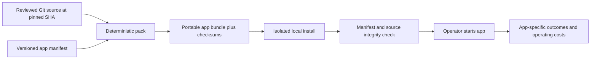

# A2Z Agent App Factory

A reproducible **package → install → verify → run** path for A2Z business applications. The first packaged app is [A2Z Resolution Deploy](https://github.com/AAH20/a2z-resolution-engine), pinned to an exact Git commit. Its installed synthetic demo prepares a human-reviewable customer-support draft without connecting to a helpdesk.

**Release boundary:** v0.1 is a local OSS bundler and installer. It is not an AWS or Microsoft Marketplace listing, hosted multi-tenant runtime, customer installation, publisher-signature system, automatic updater, or billing platform. The checked-in example and CI exercise invented support data only. A checksum proves local byte consistency, not who published the source.

## Quick start

Python 3.11+, Git and a clean checkout of the pinned source are required. The app runtime has no third-party dependencies.

```bash
python -m pip install -e .
git clone https://github.com/AAH20/a2z-resolution-engine.git /tmp/a2z-resolution-source
git -C /tmp/a2z-resolution-source checkout 5aa314fb1b2b24cb0a90d6b3a64d5af83b49c5c2

a2z-app pack apps/resolution-deploy.json /tmp/a2z-resolution-source \
  --output /tmp/a2z-resolution.a2zapp
a2z-app install /tmp/a2z-resolution.a2zapp /tmp/a2z-resolution-installed
a2z-app verify /tmp/a2z-resolution-installed

export RESOLUTION_ENGINE_KEY='replace-with-a-private-random-32-plus-character-value'
a2z-app run /tmp/a2z-resolution-installed -- \
  --knowledge /tmp/a2z-resolution-installed/source/examples/knowledge.synthetic.json \
  --db /tmp/a2z-resolution-demo.sqlite3 \
  prepare \
  --ticket-file /tmp/a2z-resolution-installed/source/examples/zendesk-ticket.synthetic.json \
  --locale en
```

The `run` command executes the app in its local Python environment. It never supplies helpdesk credentials itself. The demo returns `PENDING_REVIEW` and a sourced draft; no customer reply is sent. For the underlying review and Zendesk send limits, see [Resolution Deploy's deployment guide](https://github.com/AAH20/a2z-resolution-engine/blob/main/docs/DEPLOYMENT.md).

## What the bundle contains

`a2z-app pack` reads the [versioned manifest](apps/resolution-deploy.json), checks that local `HEAD` equals its pinned commit, refuses modified tracked files, and archives that commit with `git archive`. Untracked files and `.git` are excluded. The `.a2zapp` file contains the canonical manifest, an index of SHA-256 digests, and the Git source archive. ZIP timestamps are fixed so repeated packaging of the same revision produces the same bundle bytes.

Installation rejects unsafe archive paths, links, oversized entries and overwrites. It extracts source into a new target, creates a local Python environment, and records a receipt. `verify` recomputes the source tree digest and manifest digest before `run`. The installed application is trusted code from the pinned revision; inspect that revision before running it. The current format has **no publisher signature or transparency log**, so it is not sufficient for an untrusted third-party app store.



## Why this project exists

The A2Z portfolio already has task-specific engines, but a repo with passing tests is not yet an installable customer application. This factory standardizes the first delivery boundary: exact source revision, repeatable package, safe installation, local verification and a runnable app entrypoint. The same contract can package Fulfillment-to-Cash after its installation and data handling requirements are validated.

The OSS layer contains the manifest contract, bundler, installer, verifier, synthetic integration test and examples. The commercial product can provide approved connectors, customer onboarding, hosted operations, authenticated reviewers, upgrades, support and billing. Those services are **not implemented here**. See [architecture and release gates](docs/ARCHITECTURE.md).

## Tests

```bash
PYTHONPATH=src python -m unittest discover -s tests -v
```

The tests create a tiny temporary Git app and check byte-for-byte bundle repeatability, install, execution, tamper rejection, pin mismatch, dirty source rejection and archive traversal rejection. CI also packages the pinned Resolution Deploy revision and runs its synthetic draft flow.

Apache-2.0 licensed. Report security issues privately; see [SECURITY.md](SECURITY.md).
