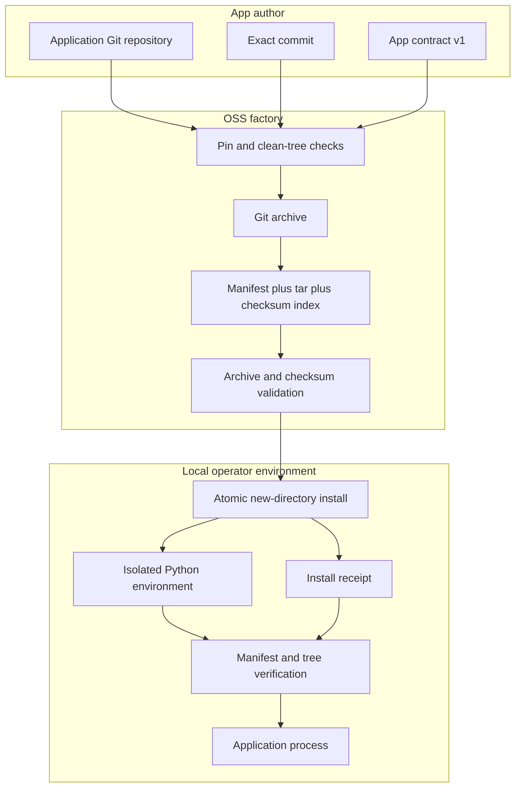
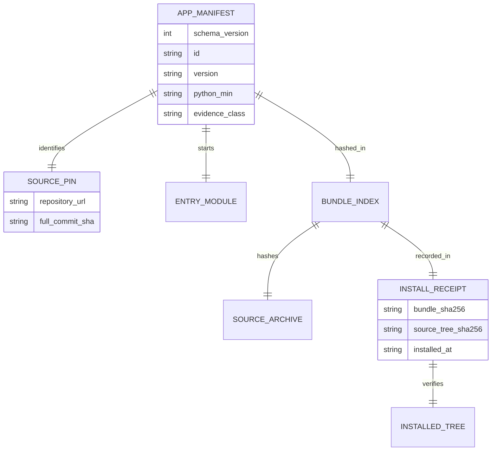
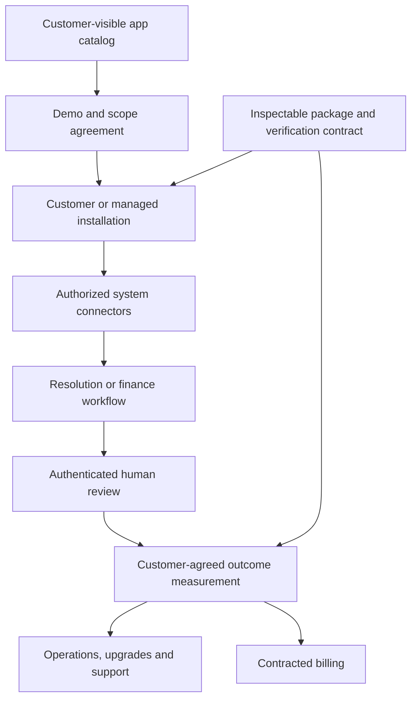

# Architecture and evolution

## Current OSS execution

The installer accepts a bundle, not a repository URL, and makes no network call. `git archive` runs during packaging only. Execution uses `subprocess` argv and a Python module path, never a shell command from the manifest. The app itself may use network access when an operator explicitly invokes its capabilities; the factory does not sandbox application code or enforce egress policy.

## Application contract

The app ID and semver are labels; the source commit and digests bind a specific code version. The current v1 manifest permits only `SYNTHETIC_DEMO_ONLY` because no customer installation or independently verified publisher identity exists yet. A later production format should add signed publisher identity, dependency lockfile/SBOM, permissions, data classification, configuration schema, health checks and upgrade/rollback hooks. Version the format rather than silently reinterpreting v1 fields.

## Prospective commercial service

This is an intended service architecture, not the current OSS implementation. The first customer pilot should use Resolution Deploy with customer-authorized Zendesk OAuth, approved knowledge, authenticated reviewer identity, a scoped data-processing agreement and a human-controlled reply path. Fulfillment-to-Cash should follow only when one customer's export and finance review semantics are validated. Both applications require customer outcome definitions before outcome-based billing.

## Distribution path

[AWS Marketplace](https://aws.amazon.com/marketplace/solutions/ai-agents-and-tools) and [Microsoft Agent Store](https://learn.microsoft.com/en-us/microsoft-365/copilot/copilot-agent-store) already support discovery of agent products. The `.a2zapp` format is a local OSS bundle; it is **not** a valid listing artifact for either channel. Marketplace distribution requires their own seller, packaging, security, commercial and review processes. Start with an owned customer installation, then package the proven app for a channel instead of claiming a listing from this repository.

## Production metrics and economics

Track installation completion rate, time to first successful workflow, weekly active customer organizations, accepted work, rework, connector incidents, upgrade success, rollback time, support hours and churn. For each customer, contribution margin is **collected fees minus model/compute, connector operations, human review, support, payment, hosting and rework costs**. A source checksum, installed app or drafted reply is not a billable outcome. The first economic validation is one customer paying for recurring use with the delivery costs measured; no synthetic fixture can establish that margin.

## Release gates

1. **OSS reference (current):** pinned source, deterministic bundle, safe local extract, independent verify, synthetic app run and CI.
2. **Customer pilot:** one authorized installation, controlled data, authenticated reviewers, documented operating support and accepted outcome definition.
3. **Trusted software supply chain:** publisher signatures, key rotation, SBOM, dependency pinning, vulnerability handling, signed releases and an update/rollback strategy.
4. **Repeatable installations:** configuration validation, tenant-scoped secrets, health checks, backup/restore, observability and support runbooks.
5. **Commercial distribution:** customer references, channel-specific listing review, contractual billing and support capacity.
